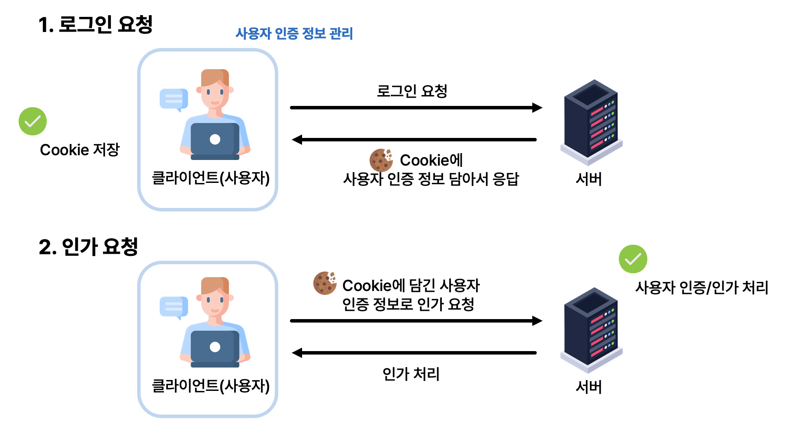

# 2024 이노베이션 캠프 | React 주특기 과제 Level 4

> Goal : 로그인/회원가입 기능 추가하기

## ✅ features : 구현해야 할 기능이에요.

- 로그인, 회원가입 페이지를 각각 구현합니다.
- 아이디와 비밀번호가 모두 입력되지 않으면, API 요청을 보내지 않도록 합니다.
- 서버의 에러를 `alert` 또는 직접 만든 모달 등을 통해 유저에게 표시합니다.
  - id가 중복된 경우
  - 존재하지 않는 아이디를 입력한 경우
  - 비밀번호가 잘못된 경우
- JWT의 유효시간이 만료된 경우, 유저에게 재로그인을 할 것을 표시합니다.
- 로그인을 하지 않은 경우에는 `로그인/회원가입` 페이지만 접근 가능합니다.
- 로그인을 이미 한 경우 `로그인/회원가입` 페이지는 접근 할 수 없습니다.
- 로그아웃 기능을 구현합니다.

### 참고사항

- mock 서버에서 발급된 JWT의 유효시간은 60분입니다.
- mock 서버 URL : http://3.38.191.164/
- mock 서버 API 명세 : https://www.notion.so/dolphin-pc/React-Lv-4-c07859f9ea8a4cf2aea0563f70133163?pvs=4#85fe75404acc43f0896b7125e65d4d1c

## ❓ Why: 과제 제출시에는 아래 질문의 답변과 함께 제출해주세요.

<details>
  <summary>1. 특정 유저 (예: 비로그인 유저)의 페이지 접근을 제한하기 위한 전략이나 방식은 무엇이었나요?</summary>

### 📌 `Route` 컴포넌트를 감싸는 `PrivateRoute`를 만들어, `isAuth`와 `token만료여부`에 따른 분기처리를 했습니다.

```tsx
function App() {
return (
  <BrowserRouter>
    <RecoilRoot>
      <Routes>
        <Route element={<PrivateRoute isAuth={false} />}>
          <Route path="/" element={<LoginPage />} />
          <Route path="/register" element={<ResiterPage />} />
        </Route>
        <Route element={<PrivateRoute isAuth={true} />}>
          <Route path="/auth" element={<AuthPage />} />
          <Route path="/test-auth" element={<TestAuthPage />} />
        </Route>
      </Routes>
    </RecoilRoot>
  </BrowserRouter>
);
}


interface Props {
/** true:인증, false:인증불필요 */
isAuth: boolean;
}

const PrivateRoute = ({ isAuth }: Props) => {
const {
  token
} = useAuth();

...

//* 인증 필요 페이지
if (isAuth) {
  return token ? <AuthOutlet /> : <Navigate to="/" />;
}

//* 인증 불필요 페이지
return token ? <Back /> : <Outlet />;
};

export default PrivateRoute;

```

</details>

<details>
<summary>2. API 요청과 같은 비동기 작업 중 발생할 수 있는 에러에 대비해 에러 핸들링을 구현하셨나요? 구현했다면, 어떠한 방법을 사용하셨나요?</summary>

## 📌 axios의 `interceptor`를 통해 공통 에러처리를 진행했습니다.

```tsx
import axios from "axios";

const api = axios.create({
  baseURL: "http://3.38.191.164/",
});

api.interceptors.response.use(
  (response) => response,
  (error) => {
    if (error.response.status === 401) {
      console.log(error.response.data);
      alert(error.response.data.message);
      return Promise.reject(error);
    }
  }
);

export default api;
```

</details>

<details>
<summary>3. Redux toolkit의 Thunk 미들웨어를 활용하였나요? 활용했다면, thunk가 필요한 이유를 설명해 주세요.</summary>

| 이번 프로젝트에서는, `recoil` `Rudux-toolkit` 두 가지 방식으로 진행했습니다.

## 📌 API통신의 비동기처리를 위해, `thunk`가 필요했습니다.

- RTK의 비동기 처리를 위해, `middleware`설정을 해주었고, `/login`API와 통신하는 `__login` thunk함수를 만들었습니다.

```tsx

// api.ts
export const fetchLogin = async ({
  id,
  password,
}: LoginReq): Promise<LoginRes> => {
  const response = await api.post("/login", { id, password });
  return response.data;
};

// auth.slice.ts
export const __login = createAsyncThunk<
  LoginRes,
  LoginReq,
  { rejectValue: string }
>("tokenSlice/login", async (payload: LoginReq, thunkAPI) => {
  const data = await fetchLogin(payload);
  thunkAPI.fulfillWithValue(data);
  return data;
});

export const tokenSlice = createSlice({
  name: "tokenSlice",
  initialState,
  reducers: {},
  extraReducers: (builder) => {
    builder.addCase(__login.fulfilled, (state, action) => {
      state.data.token = action.payload.token;
      state.data.expiredAt = new Date().getTime() + 1000 * 60 * 60;
      state.data.isExpired = false;
    });
  },
});

// LoginPage.tsx
const LoginPage = () => {
  const dispatch = useDispatch<AppDispatch>();

  const handleLogin = (e: FormEvent) => {
    e.preventDefault();

    // FormData
    const formData = new FormData(e.target as HTMLFormElement);
    const id = formData.get("id")?.toString();
    const password = formData.get("password")?.toString();

    if (!id || !password) return alert("아이디와 비밀번호를 입력해주세요.");

    dispatch(__login({ id, password }));
  };

  ...
}

```

</details>

<details>
<summary>4. JWT 토큰은 무엇인가요?</summary>

## 📌 Json형태로 사용자의 인증정보를 암호화한 토큰으로, Client가 Server에 인가데이터를 요청할 수 있는 `인가(Authorization)`입니다.



### 장점 👍

#### 1. 비연결성(stateless) - 서버는, JWT를 통해 클라이언트의 인증 상태를 `매번 확인`할 필요가 없어 `stateless`합니다.

- 리소스 절감 : 인가 데이터의 요청때마다, 사용자의 인증상태를 확인하는 대신 JWT의 검증여부로 판단하기에 `서버의 리소스가 절감`됩니다.
  - 인증 상태 확인을 위한, `DB데이터 확인`, `session관리` 등
- 확장성 : 서버 간 인증상태를 공유할 필요가 없어, 서버의 `Scale-out(서버증설)`이 용이합니다.

### 단점 👎

#### 1. 정보 노출

- JWT의 payload에는 JSON형태로 다양한 정보가 담길 수 있습니다. 하지만, 이는 클라이언트 측에 저장되어 탈취될 위험이 존재합니다.
- 토큰 탈취의 경우를 고려하여, `전화번호, 주민번호 등 민감 정보`는 JWT에 담지 않도록 하는 것이 좋습니다.

#### 2. 토큰 탈취

- 토큰은 클라이언트에 저장되기에 `XSS공격`에 의해 탈취될 수 있습니다.
  - XSS(Cross-Site Scripting) : 악성 사용자가 심어놓은 코드를 통해, 정보를 빼돌리는 기법

#### 3. 만료시간 관리

- 토큰이 탈취되었다면, 악성사용자에 의해 토큰이 남용될 수 있습니다.
  - 토큰시간의 사용시간이 길다면(1달), 해당 토큰으로 많은 범죄를 저지를 수 있게 됩니다.
  - 토큰시간의 사용시간이 짧다면(1분), 짧은 기간마다 토큰의 재발행을 해야하는 `사용자의 경험이 저하`될 수 있습니다.

### 단점 보완방법

#### 🔄 Refresh Token 사용

- [블로그 게시글](https://velog.io/@dolphin-pc/JWT%EC%99%80-%EB%B8%8C%EB%9D%BC%EC%9A%B0%EC%A0%80-%EC%A0%80%EC%9E%A5%EC%86%8C)
- Access Token은 인가를 위한 것으로 사용하고, Refresh Token은 Access Token의 재발급을 위한 용도로 사용합니다.
  - AT는 만료기간을 짧게 하고, RT는 만료기간을 길게 합니다.
  - AT는 Local Storage에 저장하여, `XSS`에 탈취되어도 만료시간을 짧게 합니다.
  - RT는 Cookie에 저장하며, `CSRF`에 의한 공격에 안전하도록 합니다.

</details>

## 프로젝트 환경

- ⚙️ React, Vite, yarn
- 📕 axios, recoil, redux-toolkit

```
// 프로젝트 시작
yarn
yarn dev
```
